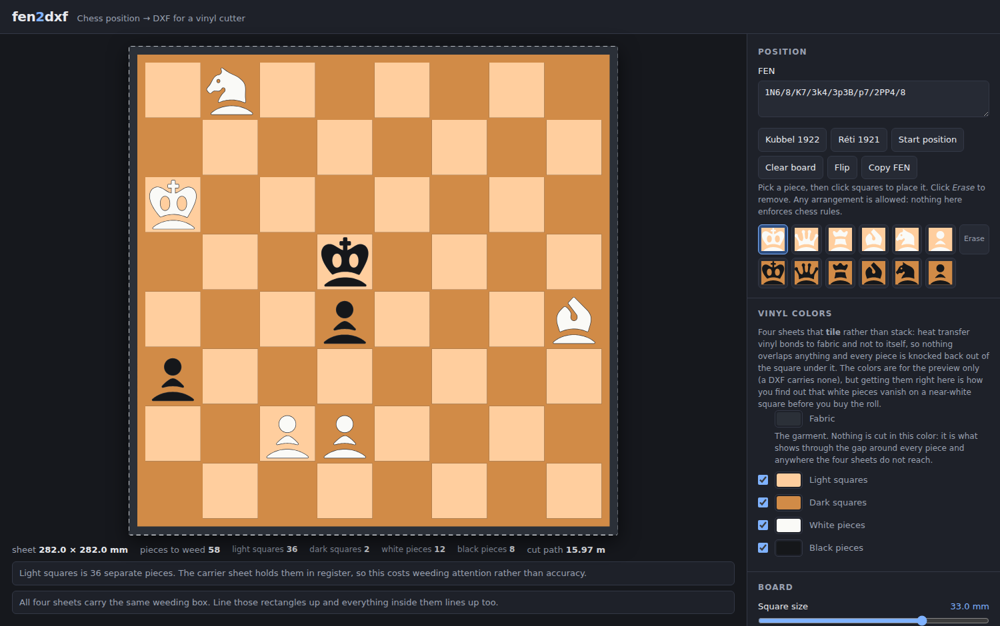

# fen2dxf

Turn a chess position into DXF cutting files for a vinyl cutter. Paste a FEN or arrange the
pieces by hand, pick your four vinyl colours, and get four files that a Silhouette Cameo will
cut. Built for **heat transfer vinyl**: the four sheets tile the design exactly and never
overlap.

It is a PWA: install it and it works offline, with no network access at all, next to the
cutter.



## Four sheets, not one

DXF has no fills. A cutter cuts closed contours and you weed away what you do not want, so the
whole job is deciding which polygons to emit — and the first decision is how many colours you
are working with.

**Two colours cannot do it.** With one sheet over a contrasting surface there are four
combinations of piece colour and square colour, and one of them has nowhere to go: a piece the
same colour as the square it stands on can only be drawn as an outline. On vinyl an outline is
a closed ring a millimetre or so wide with nothing holding it, and it does not survive weeding
or transfer. Everything else about the one-sheet design followed from working around that:
clearance gaps, outline rings, a scrap filter for the flecks the gaps detached.

Four sheets remove the problem instead — light squares, dark squares, white pieces, black
pieces, every shape solid, and a piece told from its square by the colour of the vinyl it was
cut from rather than by a gap.

## They tile, they do not stack

**Heat transfer vinyl bonds to fabric, not to itself.** Anything laid over another sheet simply
does not stick, so there is no free overlap to hide registration error in. Every square
millimetre of the design belongs to exactly one sheet:

| | sheet | what it is |
|---|---|---|
| 1 | light squares | the light squares |
| 2 | dark squares | the dark squares |
| 3 | white pieces | every white piece, solid |
| 4 | black pieces | every black piece, solid |

- **Every piece is knocked back out of the square under it**, `gap` wider all round. The counters
  the font draws inside a piece — the king's two eyes, the knight's one — survive that knockout
  as small islands of *square* colour, which is what the drawing means and guarantees they
  contrast with the piece.
- **The two square sheets are exact complements.** One is the continuous ground: the frame, the
  lattice and its own 32 squares, all one decal. The other is whatever is left.

`gap` is the only tolerance in the design. Positive leaves a hairline of bare fabric around every
piece, which absorbs cutting error and reads as a deliberate outline; zero butts the edges
exactly; negative overlaps, which is wrong for HTV but is the safer choice for adhesive vinyl.

A test checks all six sheet pairs for shared area, because this is the property everything else
rests on.

The squares default to `#ffce9e` / `#d18b47`, the pair every Wikipedia chess diagram uses. The
four colours must be mutually distinguishable *in pairs* — white pieces against the light
squares, black pieces against the dark — and the fabric colour matters too, since it shows
through every gap. All five are editable so you can check contrast before buying the roll.

**All four sheets carry the same weeding box.** Besides letting the waste peel off in one pull,
four sheets sharing one exact rectangle is the entire registration scheme: line those rectangles
up and everything inside them lines up too. Nothing overlaps, so they can be pressed in any
order.

## What is still hard

**Squares of one colour touch only at corners**, which is zero width and cuts apart into 32
loose tiles. Shrinking them by `inset` (**grout**, the default) makes the *other* colour a
continuous ground, one decal carrying the frame, the lattice and its own 32 squares. With no
overlap allowed, that leaves this sheet as 32 separate tiles.

**Interlock** bridges the tiles diagonally so they come off as one decal too — and it is not the
default, because it cannot be made to look right. Two squares of one colour meet at a corner at
exactly zero width, so *any* connector between them, of any shape and any positive width, has to
intrude on the two squares of the other colour that meet at the same point. The bridge shows as
a tile-coloured square sitting between the corners of two ground squares, at 31 of the 49
interior vertices:

```
   interlock                    grout
  ┌─────┬─────┐               ┌─────┬─────┐
  │light│dark │               │light│dark │
  ├───┌─┴─┐───┤   <- bridge   ├─────┼─────┤   <- corners stay
  │dark└─┬─┘light│               │dark │light│      solid dark
  └─────┴─────┘               └─────┴─────┘
```

What it buys is also worth less than it looks. The negative space you weed is identical either
way; the tiles being separate only matters if something has to hold them in register, and heat
transfer vinyl arrives on a tacky carrier sheet that does exactly that. Interlock is solving a
transfer-tape problem HTV does not have. It stays available because adhesive vinyl does have it.

When it is used, the bridges must form a **spanning tree** — 31 vertices, not all 49. The two
sheets are exact complements, and a tree does not separate the plane, so the ground survives in
one piece. Close the 18 remaining cycles and each encircles a ground square and cuts it loose:
the ground goes from 1 decal to 19. That is not a tuning preference, which is why it is not
offered as a setting.

Two measured formulas govern the widths, and they are pleasantly decoupled:

| sheet | narrowest point | at the defaults |
|---|---|---|
| continuous ground | `2*sqrt(2)*inset` | 1.72 mm |
| bridged tiles | `sqrt(2)*(bridgeWidth/2 - inset)` | 1.45 mm |

The bridges never weaken the ground — its minimum is set by the 18 corner junctions they do not
touch — so the grout inset and the bridge width can be tuned independently. Both formulas are
asserted at three insets.

**Nothing stops a feature coming out at a third of a millimetre**, and material that narrow
tears while being weeded rather than failing loudly at cut time. Every sheet is checked
separately and the preview highlights what is delicate.

## The minimum-feature check

Erode the design by half the minimum feature width. Anything narrower is pinched through, so
counting the pieces each decal is left in answers the only question that matters:

- a decal left in **two or more** pieces has a **neck** that will tear;
- a decal left in **none** is thinner than the threshold throughout and will lift with the waste;
- material that is thin but neither splits nor vanishes is a **protrusion** — the sharp horn of
  a base crescent, say — which is attached to bulk material and will survive. It is highlighted
  but not reported as an error.

Connectivity is judged on the erosion, never on an opening. Eroding and dilating back with
mitred joins is *exactly invertible* for rectilinear shapes, so an opening-based check silently
reconstructs the cut it just made and reports a severed lattice as sound.

## DXF

The dialect is copied from a file already known to import correctly into Silhouette Studio,
rather than guessed:

- R12 (`AC1009`), but with `$INSUNITS` = 4 (mm) and `$MEASUREMENT` = 1 written anyway
- a minimal `TABLES`/`LAYER` section declaring only layer `0`, and every entity on layer `0`
- closed `POLYLINE` (`66`=1, `70`=1) + `VERTEX` + `SEQEND`
- no `SPLINE`, `ELLIPSE`, `ARC`, `BLOCK` or `INSERT` — every curve is flattened first

Colour is not in the file. A DXF carries none, and each sheet is a separate cut anyway, so the
four colours exist only in the preview and the filenames. There is an R2000 / `LWPOLYLINE`
toggle if you want it, and a one-click 100 mm calibration square so you can confirm the import
scale once and stop thinking about it.

## Using it

```
npm install
npm run dev        # dev server
npm run build      # production PWA into dist/
npm test           # geometry, composition, checker and DXF round-trip
npm run typecheck
npm run glyphs     # regenerate src/core/glyphs.gen.ts from assets/font/chess.otf
```

Defaults: 33 mm squares, a 4 mm frame and a 5 mm weeding box, so each sheet is 282 mm square
and fits an 11.5 in cutting area with room to spare. The Kubbel study comes off as 58 decals
across the four sheets, 36 of them the light tiles; the starting position is 125. That number
matters less than it looks — the carrier sheet holds them all in register. The position is kept
in the URL, so a link reproduces a diagram exactly.

The default position is **Leonid Kubbel, *Schachmatny Listok* 1922** — White to move and win,
1.Nc6!! — because eight men doing something show off a board better than thirty-two men hiding
it. "Start position" is one click away.

Nothing enforces chess rules. Nine pawns, no kings and a pawn on the first rank are all fine —
this draws pictures, it does not referee games.

## Deploying

Cloudflare now offers static sites through **Workers with static assets** rather than Pages, so
`wrangler.jsonc` is what the dashboard's Git flow expects. There is no Worker script: `assets`
with no `main` serves the built directory from the edge.

Connecting the repo, set **build command** `npm run build` and **deploy command**
`npx wrangler deploy`. There is no output-directory field in that flow — `wrangler.jsonc` says
`./dist`. Or deploy without connecting a repo:

```
npx wrangler login
npx wrangler pages deploy dist --project-name fen2dxf   # Pages
npx wrangler deploy                                     # Workers
```

Two files exist only for this:

- **`.node-version`** pins Node 22. Vite 8 needs 20.19+, and the build image picks its own
  default otherwise.
- **`public/_headers`** caches `/assets/*` for a year — Vite fingerprints those names, so the
  name changes whenever the bytes do — and forces revalidation of `sw.js`, `index.html` and the
  manifest. Cache the service worker and an installed copy can never learn a new version
  exists, so the update silently never arrives. Verified working under Workers static assets,
  which consumes `_headers` as config rather than serving it.

## Licence

Application code is **MIT** (see `LICENSE`).

Piece artwork comes from the **Chess** font by **James Kilfiger**, which its own copyright
string dedicates to the public domain. Nothing this app exports is encumbered. See
`assets/font/ATTRIBUTION.md` for what is used and for the two repairs made to it.
